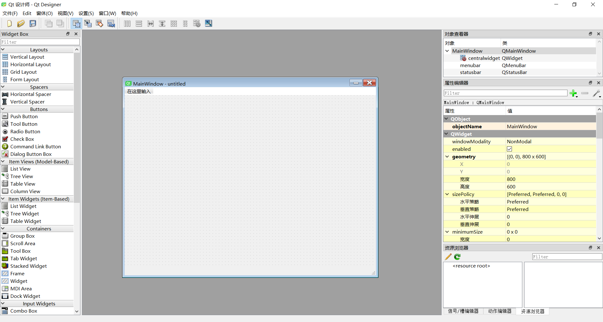

# 软件著作权申请指南

---

**请密切关注奖学金评分认定细则，趋势为软著无法为奖学金认定加分**
至2021年3月，软著与实用新型专利等同认定，一篇加3分，最多认定5篇。
本教程使用pyqt5实现，因此需要具备python语法基础。

---

## 所需环境

- Anaconda

- PyCharm

- 安装PyQt5
  在cmd中运行

  ```bash
  conda install pyqt5
  ```

## 软著撰写流程

1. 使用QtDesigner设计制作软件界面
2. 撰写业务逻辑代码（可选）
3. 撰写软著申请材料
4. 上传申请材料至学院科研管理平台

## QtDesigner使用方法

- 启动QtDesigner
  双击运行```[anaconda所在文件夹]\Lib\site-packages\pyqt5_tools\designer.exe```
  软件界面如下图所示。
  
  选中main window点击创建，创建一个主界面（窗体）。
  
- 界面介绍
  - 左侧widget box中为控件，例如按钮、文本输入框、标签等。点击所需控件拖动至创建的窗体中即可。
  - QtDesigner中央为软件界面编辑区域。
  - 右侧属性编辑器中可编辑控件、窗体各项属性，例如按钮上显示的图标、按钮是否可被点击等。
  - 右下方资源管理器中可添加icon图标。

